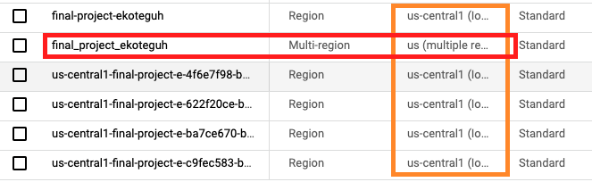

# DAG and SQL files

## DAG

Based on the `Project Flow Diagram`, we build data pipeline:
- to extract CSV files and convert into parquet files
- to load the parquet files to Big Query: STAGING
- to transform data in STAGING to DW datamodels and load the result to Big Query: DW

## Airflow Variables

Define the variables which will be loaded in DAG file.

```python
# example
project_id = "de4-final-project-ekoteguh"
dataproc_region = "us-central1"
dataproc_zone = "us-central1-a"
```

## Notes

- If you want to send data from Cloud Storage to BigQuery using Airflow, make sure that server location is same.

